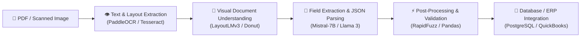

# Awesome Invoice AI Extraction 📄🤖⚡

  

  <b>A curated list of top SaaS platforms and open-source GitHub projects for Intelligent Document Processing (IDP), Optical Character Recognition (OCR), LLM-based parsing, and Accounts Payable (AP) automation.</b>

  
  
  
  
  
  

---

## 📌 Table of Contents
- [📊 Market Insights & Industry Overview](#-market-insights--industry-overview)
- [💼 SaaS / Hosted Platforms](#-saas--hosted-platforms)
- [💻 Open-Source GitHub Projects](#-open-source-github-projects)
- [🛠️ Additional Specialized Tools & Libraries](#-additional-specialized-tools--libraries)
- [🏗️ Reference Architecture for Custom IDP](#%EF%B8%8F-reference-architecture-for-custom-idp)
- [🤝 How to Contribute](#-how-to-contribute)
- [💖 Support & Sponsorship](#-support--sponsorship)
- [📈 Star History](#-star-history)
- [⚠️ Disclaimer](#%EF%B8%8F-disclaimer)

---

## 📊 Market Insights & Industry Overview

> 📈 **Market Size & Projection:** The global **Intelligent Document Processing (IDP)** & Invoice AI market is estimated at **$3.3 Billion – $4.1 Billion** in 2026, and is projected to expand rapidly to **$13 Billion – $89 Billion by 2034–2035** at a compound annual growth rate (CAGR) of 16% – 33%.
>
> 🧩 **Market Dynamics:** The market is currently **moderately fragmented**. It is transitioning from legacy rule-based OCR software to next-generation agentic AI and multimodal Large Language Models (LLMs). While cloud giants like Google Document AI hold massive infrastructure share, specialized vendors (Rossum, Nanonets, Veryfi) and open-source developer toolkits capture significant market segments due to complex workflow needs and data privacy requirements.

---

## 💼 SaaS / Hosted Platforms

Below is a comparative breakdown of leading enterprise SaaS and API platforms for automated invoice & document extraction, sorted by company revenue/valuation size in descending order:

| 🏢 Platform | 💰 Pricing (Starting Tier) | 🎁 Free Tier / Trial Limit | 📊 Company Size (Revenue / Valuation) | 💡 Key Features & Overview |
| :--- | :--- | :--- | :--- | :--- |
| **[Google Document AI](https://cloud.google.com/document-ai)** | **$0.10** per 10-page block (Invoice Parser) | **No recurring free tier** (Requires Google Cloud billing; evaluation via GCP free trial credits) | **$3+ Trillion** market cap (Google Cloud division) | Enterprise document processing with pre-trained invoice parsers, OCR, and custom model training. |
| **[Rossum](https://rossum.ai)** | Custom annual contract (typically starts at **~$30,000/year**) | **No free tier** (Custom enterprise demo on request) | **$500M - $1B** valuation (Acquired by Coupa in 2026; $25M–$50M ARR) | Cloud-based document gateway using AI with human-in-the-loop validation for touchless AP automation. |
| **[Affinda](https://www.affinda.com)** | **$0.20** / page (Starter Plan; down to $0.05/page at volume) | **14-day free trial** (Includes ~200 credits) | **$120 Million** valuation ($22.9M+ funding) | Developer-first AI document platform with multi-language invoice parsing and custom layout training. |
| **[Nanonets](https://nanonets.com)** | **$100** / month (Starter plan; ~$0.10–$0.30/run) | **$50 free credits** (~500 simple pages; no credit card required) | **$100 Million** ARR ($42M total funding) | AI-powered IDP platform for invoice extraction, expense management, and no-code model training. |
| **[Veryfi](https://www.veryfi.com)** | **$500** / month minimum commitment ($0.16/invoice) | **100 documents / month** (Free API Tier forever) | **~$20 Million - $30 Million** estimated ARR | Real-time sub-second OCR & LLM parsing API for invoices, receipts, and checks. |
| **[Klippa](https://www.klippa.com)** | **€5** / user / month (SpendControl; custom API plans) | **No free tier** (Enterprise demo & guided trial) | **~$21.5 Million** ARR (Acquired by SER Group in 2025) | Financial document automation platform with OCR and AI for invoice processing & receipt validation. |
| **[Docsumo](https://www.docsumo.com)** | **$299** / month (Growth Plan) | **14-day free trial** (Includes 100 test pages) | **~$10 Million** ARR ($3.5M+ seed funding) | Intelligent document parser specializing in invoices and financial statements with high accuracy claims. |
| **[Mindee](https://mindee.com)** | **€44** / month (Starter Plan billed annually) | **14-day free trial** (Includes 200 parsing pages) | **~$5 Million - $10 Million** estimated ARR ($14M funding) | Developer-first document parsing API for financial documents, invoices, and receipts. |
| **[Parseur](https://parseur.com)** | **$39** / month (Starter Plan for 100 credits) | **20 pages / month** (Free forever plan; no credit card) | **~$1 Million - $3 Million** estimated ARR | AI-powered document parser for invoices, emails, and PDFs with webhook & Zapier integrations. |
| **[Extracta.ai](https://extracta.ai)** | Pay-as-you-go (~**$0.10 - $0.15** / page) | **50 free pages** (On account registration) | **~$220,000** ARR (Bootstrapped AI startup) | Flexible AI data extraction platform for invoices and receipts with customizable templates. |

---

## 💻 Open-Source GitHub Projects

Curated list of open-source software, models, and complete applications for self-hosting invoice extraction, fine-tuning document AI models, and local OCR. 

*Sorted by GitHub Star count in descending order:*

| 📦 Project & Repository | ⭐ Stars | 🛠️ Tech Stack & Highlights | 📝 Description |
| :--- | :---: | :--- | :--- |
| **[PaddleOCR](https://github.com/PaddlePaddle/PaddleOCR)** |  | Python, PaddlePaddle, C++ | Ultra-lightweight OCR toolkit and document layout analysis engine supporting 80+ languages. |
| **[Tesseract OCR](https://github.com/tesseract-ocr/tesseract)** |  | C++, C | Google's legendary open-source OCR engine. The foundational building block for document parsers worldwide. |
| **[EasyOCR](https://github.com/JaidedAI/EasyOCR)** |  | Python, PyTorch | Ready-to-use Python OCR library supporting 80+ languages and popular text detection models. |
| **[LayoutLMv3 (unilm)](https://github.com/microsoft/unilm)** |  | Python, PyTorch, Transformers | Microsoft's multimodal pre-trained foundation model for layout-aware document understanding and field extraction. |
| **[Donut (clovaai)](https://github.com/clovaai/donut)** |  | Python, PyTorch, Vision Encoder-Decoder | OCR-free Document Understanding Transformer for direct end-to-end visual parsing of receipts and invoices. |
| **[Camelot](https://github.com/camelot-dev/camelot)** |  | Python, OpenCV, pdfminer | Advanced Python library that makes it easy for anyone to extract tabular data from PDF invoices. |
| **[InvoiceNet](https://github.com/schrodinger-hat/InvoiceNet)** |  | Python, TensorFlow | Deep neural network designed to parse key fields (total, date, vendor) from invoice document images. |
| **[invoice2data](https://github.com/invoice2data/invoice2data)** |  | Python, pdftotext, tesseract | Extract structured data from PDF invoices using regex rules, template matching, and OCR fallbacks. |
| **[Sparrow](https://github.com/lucidrains/sparrow)** |  | Python, MLX, PyTorch | Open-source AI document data extraction tool with modular architecture. Supports local Apple Silicon (MLX) execution. |
| **[ocrbase](https://github.com/ocrbase/ocrbase)** |  | TypeScript, PaddleOCR, Docker | Self-hostable document OCR and structured data extraction API with real-time WebSockets and type-safe SDK. |
| **[eye-drop-accountant](https://github.com/ eye-drop-accountant)** |  | React, TypeScript, GPT-4 Vision | Modern web application for receipt & invoice visual parsing using OpenAI GPT-4 Vision API. |
| **[AIDocumentExtractorPro](https://github.com/AIDocumentExtractorPro)** |  | Python, PyQt6, FLAN-T5, LayoutLM | Offline GUI document parser extracting structured JSON, Excel, and SQLite from invoices and receipts. |
| **[Invoice-Data-Extractor](https://github.com/Invoice-Data-Extractor)** |  | Python, PaddleOCR, Mistral-7B | Intelligent pipeline combining PaddleOCR with Mistral-7B LLM for zero-shot field parsing. |
| **[InvoSync](https://github.com/InvoSync)** |  | React, Flask, Tesseract, RapidFuzz | AI invoice and purchase order reconciliation app with automated mismatch detection and fuzzy matching. |
| **[Donut Receipt Extraction](https://github.com/Donut-Receipt)** |  | Streamlit, Donut, PyTorch | Streamlit web demo for OCR-free receipt information extraction fine-tuned on the CORD dataset. |
| **[Invoice Image Analyzer Agent](https://github.com/Invoice-Image-Analyzer)** |  | FastAPI, React, Tesseract, Groq | Full-stack FastAPI + React invoice parsing web application powered by Groq LLMs and layout analysis. |
| **[OACA Invoice Extraction Pipeline](https://github.com/OACA-Invoice)** |  | Python, LayoutLMv3, Tesseract | End-to-end intelligent document processing pipeline fine-tuned for Named Entity Recognition (NER) on invoices. |
| **[Invoice Parser (eliashossain001)](https://github.com/eliashossain001/Invoice-Parser)** |  | Python, Tesseract, LayoutLMv3 | End-to-end script pipeline for structured extraction from PDF invoices using Donut and LayoutLMv3. |
| **[Q-Invoice-50M-Sovereign](https://github.com/Q-Invoice-50M)** |  | Python, ONNX, CPU-optimized | Lightweight 53.5M parameter sovereign specialist model designed for fast, local CPU invoice JSON extraction. |

---

## 🛠️ Additional Specialized Tools & Libraries

### 👁️ Open-Source OCR Engines
- **[Tesseract OCR](https://github.com/tesseract-ocr/tesseract)**: Industry standard C++ OCR engine with support for over 100 languages.
- **[PaddleOCR](https://github.com/PaddlePaddle/PaddleOCR)**: High-accuracy deep learning OCR system with multilingual support and text orientation detection.
- **[EasyOCR](https://github.com/JaidedAI/EasyOCR)**: PyTorch-based OCR library offering simple integration for Python developers.

### 🧠 Layout-Aware & Vision Models
- **[LayoutLMv3](https://github.com/microsoft/unilm/tree/master/layoutlmv3)**: Microsoft's multi-modal framework for document AI combining text, visual, and spatial layout features.
- **[Donut](https://github.com/clovaai/donut)**: OCR-free Document Understanding Transformer that maps image pixels directly to structured JSON output.

### 🤖 LLM-Based Field Parsing
- **Mistral-7B / Llama 3 / FLAN-T5**: Open LLM architectures utilized for zero-shot invoice parsing, entity normalization, and line item extraction.
- **OpenAI GPT-4o / Claude 3.5 Sonnet**: State-of-the-art vision models for multi-page complex document parsing and table reconstruction.

---

## 🏗️ Reference Architecture for Custom IDP

Building a private, self-hosted invoice extraction engine? Here is the standard modern open-source production stack:

---

## 🤝 How to Contribute

Contributions are welcome! Please follow these simple guidelines:

1. 🍴 **Fork** this repository.
2. 📝 **Add or edit** entries in `README.md` maintaining table formatting.
3. 🔍 **Verify details**: Ensure pricing, free tiers, and links are accurate and factual.
4. 🚀 **Submit a Pull Request** with a clear explanation of your additions.

---

## 💖 Support & Sponsorship

Thank you for exploring this curated repository! If this resource helps you build or select your Document AI / Invoice Extraction solution, please consider supporting the project:

- ⭐ **Star** this repository to help others discover it.
- 🍴 **Fork** and contribute new tools or updates.
- 📢 **Share** it with fellow developers and finance teams.
- ☕ **Sponsor / Buy me a coffee**: If you'd like to support ongoing maintenance and research, visit the [GitHub Sponsor Dashboard](https://github.com/sponsors/ishandutta2007).

---

## 📈 Star History

---

## ⚠️ Disclaimer

- This is a community-curated collection intended for educational and research purposes.
- Always check vendor pricing pages and license agreements for the latest updates.
- Ensure strict compliance with **SOC 2, HIPAA, and GDPR** regulations when processing sensitive financial invoices.

---

  <b>Made with ❤️ for finance teams, AP automation engineers, and Document AI developers worldwide.</b> 
  <i>⭐ Star this repository if you found it useful!</i>

